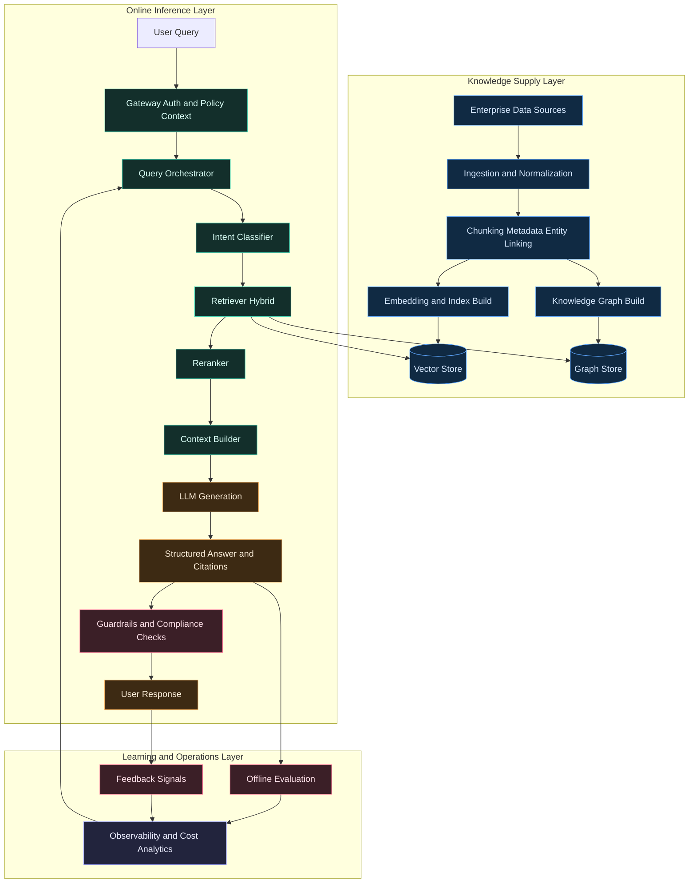
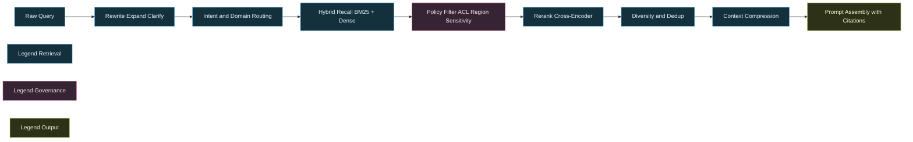
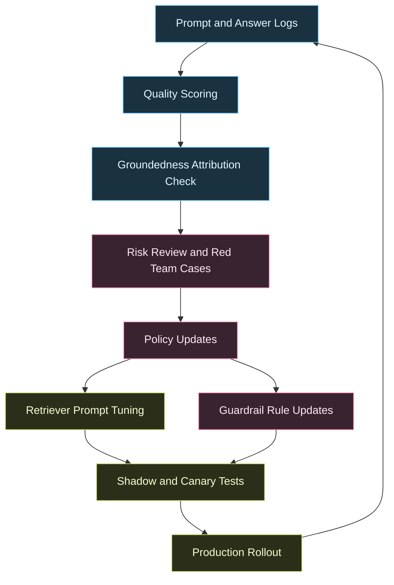

---
title: Enterprise RAG Architectures
date: 2026-03-30
excerpt: Designing retrieval-augmented generation systems for reliability, governance, and production-grade intelligence at scale.
tags:
  - RAG
  - LLM Engineering
  - Architecture
---

# Enterprise RAG Architectures

Designing retrieval-augmented generation systems for reliability, governance, and production-grade intelligence at scale.

---

## Why Enterprise RAG Is Different

A production-grade Retrieval-Augmented Generation (RAG) stack is not just "LLM + vector DB". In enterprise settings, every answer must be:

- Grounded in trusted internal knowledge
- Enforced by role and policy controls
- Observable with quality and latency SLAs
- Auditable for compliance and model risk

---

## Reference Architecture

### 1. Data Ingestion and Knowledge Processing
- Structured (databases, warehouses)
- Semi-structured (PDFs, Office docs)
- Unstructured (emails, transcripts)
- CDC + scheduled sync pipelines
- PII and policy tagging at ingestion time

### 2. Retrieval and Memory Layer
- Embedding indexes (semantic search)
- Hybrid retrieval (BM25 + embeddings)
- Metadata filters (region, sensitivity, department)
- Knowledge graph for entity-level reasoning
- Policy-aware filtering

### 3. Orchestration Layer
- Intent classification and query rewriting
- Multi-stage retrieval and reranking
- Context budgeting by token and relevance

### 4. Generation Layer
- Task-specific prompts and response schemas
- Tool-augmented generation
- Citation-first answer formatting

### 5. Trust, Safety, and Evaluation Layer
- Guardrails and policy checks
- Hallucination and groundedness scoring
- Real-time monitoring with feedback loops

---

## End-to-End Architecture Diagram

---

## Retrieval Pipeline Diagram (Operational View)

---

## Governance and Evaluation Loop

---

## Design Principles for Production RAG

- Treat retrieval as a first-class product
- Separate retrieval, reasoning, and generation concerns
- Enforce governance before and after generation
- Optimize for groundedness over fluency
- Build continuous feedback loops from real user traffic
- Prefer structured outputs over free-form responses

---

## Key Enterprise Metrics

### Retrieval Quality
- Recall at k and nDCG
- Citation coverage percentage
- Freshness lag from source to index

### Generation Quality
- Groundedness score
- Factual consistency
- Task completion rate

### Reliability and Cost
- p95 latency by route
- Cost per answered query
- Error and fallback rates

---

## Common Failure Modes and Mitigations

### Failure Mode: Retrieval Misses
- Cause: weak metadata, poor chunking
- Mitigation: schema-aware chunking + reranking + query rewrite

### Failure Mode: High Confidence Hallucination
- Cause: low-quality context or no citation enforcement
- Mitigation: citation-required templates + abstain policy

### Failure Mode: Policy Leakage
- Cause: ACL checks happen too late
- Mitigation: enforce policy filters before retrieval returns candidates

---

## Finance Example (Regulatory Intelligence)

### Typical Challenges
- Regulatory updates across jurisdictions
- Auditability and traceability requirements
- Sensitive financial data segmentation

### Architecture Pattern
- Hybrid retrieval from policy docs + controls database
- Graph linking between regulation, process, and control owners
- Structured output with source paragraph references

### Example Query
Explain variance in liquidity coverage ratio and cite relevant internal policy clauses.

---

## Healthcare Example (Clinical Knowledge Assistant)

### Typical Challenges
- Rapidly changing medical evidence
- Conflicting patient history and guideline updates
- Safety-critical response requirements

### Architecture Pattern
- Temporal retrieval with date-aware ranking
- Clinical guardrails for contraindications
- Human-in-the-loop escalation for uncertain recommendations

### Example Query
Suggest treatment adjustments for a diabetic patient with declining renal function using the latest approved protocol.

---

## Implementation Roadmap

1. Start with one high-value workflow and clear acceptance metrics
2. Build ingestion contracts and metadata taxonomy
3. Implement hybrid retrieval + reranking before model tuning
4. Add guardrails, policy checks, and citation enforcement
5. Launch shadow testing, then canary rollout
6. Close the loop with automated evaluation and user feedback

---

## Final Thought

Enterprise RAG becomes a durable competitive capability when it is engineered as a full system: retrieval quality, orchestration intelligence, governance controls, and measurable business outcomes.
